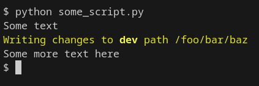

# Python

## Virtual Environments

```bash
$ python -m venv .venv
$ . .venv/bin/activate
```

## Static HTTP File Server

Running `python -m http.server 8000` will create a static file server pointed to whatever directory you ran the command in.

## Install Python from source

1. Go to https://www.python.org/downloads/ and find the desired version
2. Click on Download link. Scroll to the bottom and find "Gzipped source tarball"
3. Run `wget <tarball url>` followed by `tar -xzf <tarball name>`
4. cd into untarred directory
5. Run `./configure --enable-optimizations` followed by `suco make altinstall`

That's it! Do a `which` on the version major and minor to to confirm it's present in the `/usr/local/bin` folder (e.g. `which python3.9` for version 3.9.10)


## Colors

You can color the text output of your python scripts by wrapping strings in the following variables:


```python
FORMAT_RESET = "\x1b[0m"
FORMAT_BOLD = "\x1b[1m"
FORMAT_UNBOLD = "\x1b[22m"
FORMAT_DIM = "\x1b[2m"
FORMAT_ITALIC = "\x1b[3m"
FORMAT_UNDERLINE = "\x1b[4m"
FORMAT_RED = "\x1b[31m"
FORMAT_GREEN = "\x1b[32m"
FORMAT_YELLOW = "\x1b[33m"
FORMAT_BLUE = "\x1b[34m"
FORMAT_MAGENTA = "\x1b[35m"
FORMAT_CYAN = "\x1b[36m"
FORMAT_WHITE = "\x1b[37m"

print("Some text")
print(f"{FORMAT_YELLOW}Writing changes to {FORMAT_BOLD}{realm}{FORMAT_UNBOLD} path {some_path}{FORMAT_RESET}")
print("Some more text here")
```

Output:


