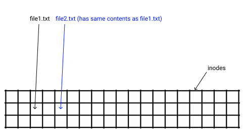
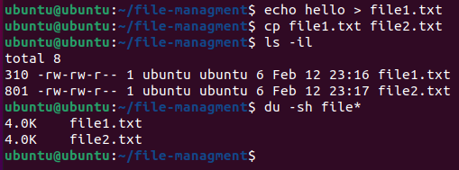
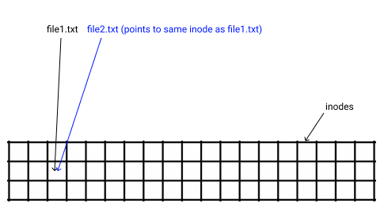
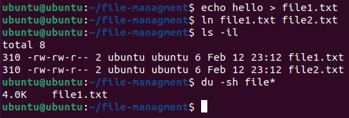
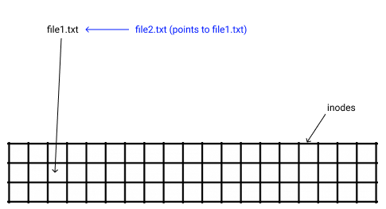
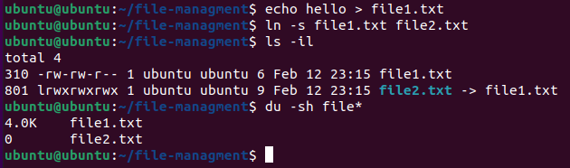

# File Management

## inodes

An inode is a data structure that stores various metadata about a file such as permissions, type, size, physical location, etc. A name of a file is a reference that points to the inode. 

```bash
myfile.txt -> (some inode ID)
```

## Copy vs Hard Link vs Soft (Symbolic) Link

### Copy

Creates a new file that points to a new memory location with the contents of the original file.





### Hard Link

Creates a new file that points to the **same** memory location as the original file. This essentially "syncs" the two files





#### Soft Link

a.k.a. symbolic link. Creates a file that points to another file. They are just pointers to the file reference (which in itself is pointing to the inode)





