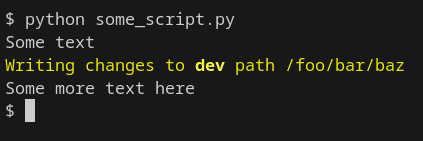

# Colors

You can color the text output of your python scripts by wrapping strings in the following variables:


```python
FORMAT_RESET = "\x1b[0m"
FORMAT_BOLD = "\x1b[1m"
FORMAT_UNBOLD = "\x1b[22m"
FORMAT_DIM = "\x1b[2m"
FORMAT_ITALIC = "\x1b[3m"
FORMAT_UNDERLINE = "\x1b[4m"
FORMAT_RED = "\x1b[31m"
FORMAT_GREEN = "\x1b[32m"
FORMAT_YELLOW = "\x1b[33m"
FORMAT_BLUE = "\x1b[34m"
FORMAT_MAGENTA = "\x1b[35m"
FORMAT_CYAN = "\x1b[36m"
FORMAT_WHITE = "\x1b[37m"

print("Some text")
print(f"{FORMAT_YELLOW}Writing changes to {FORMAT_BOLD}{realm}{FORMAT_UNBOLD} path {some_path}{FORMAT_RESET}")
print("Some more text here")
```

Output:


